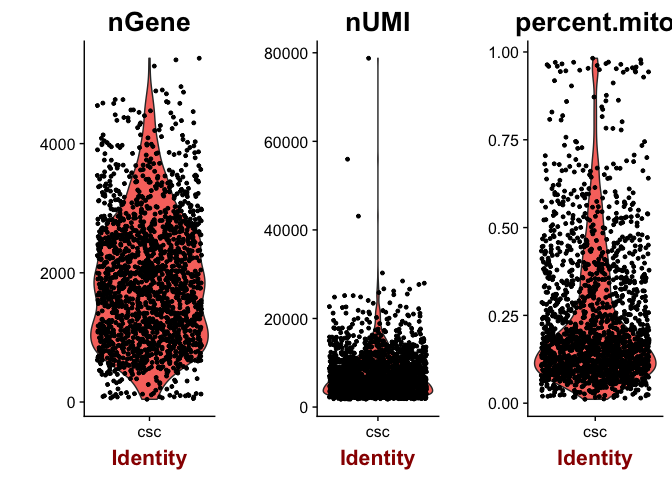
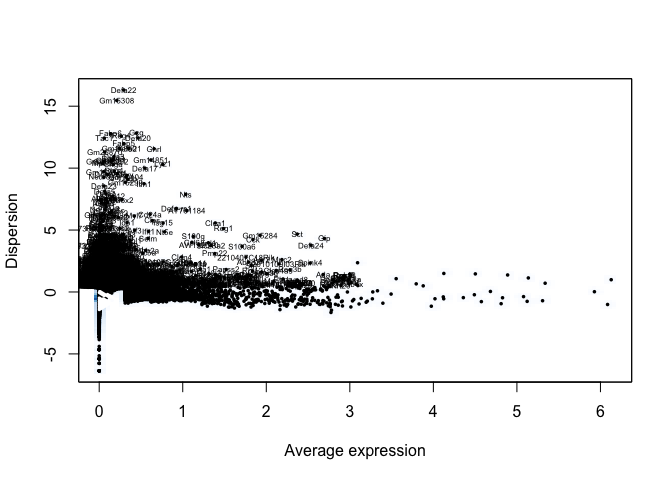
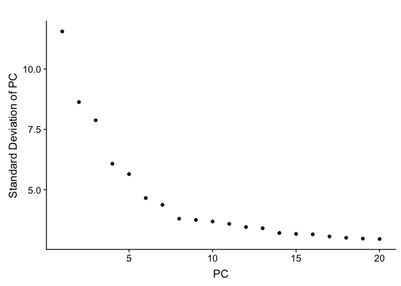

01\_prepare\_scrnaseq\_data
================

Download data from GEO
----------------------

Download the three supplementary files (barcodes, matrix and genes) from [GSM2644349](https://www.ncbi.nlm.nih.gov/geo/query/acc.cgi?acc=GSM2644349) and [GSM2644350](https://www.ncbi.nlm.nih.gov/geo/query/acc.cgi?acc=GSM2644350). Unzip the files and move them each to their folder in raw\_data.

Import the downloaded 10x cellranger output files to Seurat:

``` r
csc1.data <- Read10X(data.dir = "./raw_data/GSM2644349_Lgr5eGFP_neg_1")
csc1 <- CreateSeuratObject(raw.data = csc1.data, 
                           project = "csc1")


csc2.data <- Read10X(data.dir = "./raw_data/GSM2644350_Lgr5eGFP_neg_2")
csc2 <- CreateSeuratObject(raw.data = csc2.data,  project = "csc2")

csc.combined <- MergeSeurat(object1 = csc1, object2 = csc2, project = "csc")
```

Seurat processing
-----------------

Filter out damaged cells with a high percentage of mitochondrial genes.

``` r
mito.genes <- grep(pattern = "^mt-", x = rownames(x = csc.combined@data), value = TRUE)
percent.mito <- Matrix::colSums(csc.combined@raw.data[mito.genes, ])/Matrix::colSums(csc.combined@raw.data)

csc.combined <- AddMetaData(object = csc.combined, metadata = percent.mito, col.name = "percent.mito")
VlnPlot(object = csc.combined, features.plot = c("nGene", "nUMI", "percent.mito"), nCol = 3)
```



``` r
csc.combined <- FilterCells(object = csc.combined, subset.names = c("percent.mito"), 
                            low.thresholds = c( -Inf), high.thresholds = c( 0.5))
```

Log-normalization and identification of variable genes.

``` r
csc.combined <- NormalizeData(object = csc.combined, normalization.method = "LogNormalize", 
                              scale.factor = 10000)
csc.combined <- FindVariableGenes(object = csc.combined, mean.function = ExpMean, dispersion.function = LogVMR, 
                                  x.low.cutoff = 0.0125, x.high.cutoff = 3, y.cutoff = 0.5)
```



``` r
length(x = csc.combined@var.genes)
```

    ## [1] 5561

regress out unwanted sources of variation: nUMI and orig.ident which corresponds to sequencing sample

``` r
csc.combined <- ScaleData(object = csc.combined, vars.to.regress = c("nUMI","orig.ident","percent.mito"))
```

    ## Regressing out: nUMI, orig.ident, percent.mito

    ## 
    ## Time Elapsed:  15.934839963913 secs

    ## Scaling data matrix

``` r
csc.combined <- RunPCA(object = csc.combined, pc.genes = csc.combined@var.genes, do.print = TRUE, pcs.print = 1:5, 
                       genes.print = 5)
```

    ## [1] "PC1"
    ## [1] "Ptma"   "Rpl35"  "Rps2"   "Gm8730" "Rpl12" 
    ## [1] ""
    ## [1] "Krt20"   "Creb3l3" "Klf4"    "Mxd1"    "Dgat2"  
    ## [1] ""
    ## [1] ""
    ## [1] "PC2"
    ## [1] "S100a6"   "Tmsb4x"   "Hepacam2" "Krt18"    "Tm4sf4"  
    ## [1] ""
    ## [1] "Maoa"     "Sis"      "Aldh1a1"  "Slc6a20a" "Ace"     
    ## [1] ""
    ## [1] ""
    ## [1] "PC3"
    ## [1] "Hepacam2" "Selm"     "Agr2"     "Rgs2"     "Gcnt3"   
    ## [1] ""
    ## [1] "Clca4a"        "Pmp22"         "2010109I03Rik" "Sfn"          
    ## [5] "Slc28a2"      
    ## [1] ""
    ## [1] ""
    ## [1] "PC4"
    ## [1] "Cpe"     "Cplx2"   "Neurod1" "Fam183b" "Scgn"   
    ## [1] ""
    ## [1] "Lypd8"    "Krt19"    "Clca1"    "Lrrc26"   "AW112010"
    ## [1] ""
    ## [1] ""
    ## [1] "PC5"
    ## [1] "Top2a"     "Hist1h2ap" "Mme"       "Ace"       "Sgk1"     
    ## [1] ""
    ## [1] "Krt19"  "Car4"   "Gpx1"   "Ms4a18" "Pycard"
    ## [1] ""
    ## [1] ""

choose number of informative principal components based on PCElbowPlot

``` r
PCElbowPlot(object = csc.combined)
```



Perform clustering and tSNE dimensionality reduction.

``` r
csc.combined <- FindClusters(object = csc.combined, reduction.type = "pca", dims.use = 1:10, 
                             resolution = 1.3, print.output = 0, save.SNN = TRUE)

csc.combined <- RunTSNE(object = csc.combined, dims.use = 1:10, do.fast = TRUE)
```

Rename clusters according to marker gene expression

``` r
current.cluster.ids <- c(0,1,2,3,4,5,6,7,8,9,10)
new.cluster.ids <- c("enterocyte_4","enterocyte_2","enterocyte_3","enterocyte_1","enterocyte_6","transient_amp_1","enterocyte_5","transient_amp_2","goblet","unknown_1","unknown_2")
csc.combined@ident <- plyr::mapvalues(x = csc.combined@ident, from = current.cluster.ids, to = new.cluster.ids)
```

save resuling Seurat file:

``` r
save(csc.combined, file = "./raw_data/csc.combined_seurat.Rda")
sessionInfo()
```

    ## R version 3.5.0 (2018-04-23)
    ## Platform: x86_64-apple-darwin15.6.0 (64-bit)
    ## Running under: macOS Sierra 10.12.6
    ## 
    ## Matrix products: default
    ## BLAS: /Library/Frameworks/R.framework/Versions/3.5/Resources/lib/libRblas.0.dylib
    ## LAPACK: /Library/Frameworks/R.framework/Versions/3.5/Resources/lib/libRlapack.dylib
    ## 
    ## locale:
    ## [1] en_US.UTF-8/en_US.UTF-8/en_US.UTF-8/C/en_US.UTF-8/en_US.UTF-8
    ## 
    ## attached base packages:
    ## [1] stats     graphics  grDevices utils     datasets  methods   base     
    ## 
    ## other attached packages:
    ## [1] bindrcpp_0.2.2 dplyr_0.7.6    Seurat_2.3.4   Matrix_1.2-14 
    ## [5] cowplot_0.9.3  ggplot2_3.0.0 
    ## 
    ## loaded via a namespace (and not attached):
    ##   [1] Rtsne_0.13          colorspace_1.3-2    class_7.3-14       
    ##   [4] modeltools_0.2-22   ggridges_0.5.0      mclust_5.4.1       
    ##   [7] rprojroot_1.3-2     htmlTable_1.12      base64enc_0.1-3    
    ##  [10] rstudioapi_0.7      proxy_0.4-22        flexmix_2.3-14     
    ##  [13] bit64_0.9-7         mvtnorm_1.0-8       codetools_0.2-15   
    ##  [16] splines_3.5.0       R.methodsS3_1.7.1   robustbase_0.93-2  
    ##  [19] knitr_1.20          Formula_1.2-3       jsonlite_1.5       
    ##  [22] packrat_0.4.9-3     ica_1.0-2           cluster_2.0.7-1    
    ##  [25] kernlab_0.9-26      png_0.1-7           R.oo_1.22.0        
    ##  [28] compiler_3.5.0      httr_1.3.1          backports_1.1.2    
    ##  [31] assertthat_0.2.0    lazyeval_0.2.1      lars_1.2           
    ##  [34] acepack_1.4.1       htmltools_0.3.6     tools_3.5.0        
    ##  [37] igraph_1.2.2        gtable_0.2.0        glue_1.3.0         
    ##  [40] RANN_2.6            reshape2_1.4.3      Rcpp_0.12.18       
    ##  [43] trimcluster_0.1-2.1 gdata_2.18.0        ape_5.1            
    ##  [46] nlme_3.1-137        iterators_1.0.10    fpc_2.1-11.1       
    ##  [49] gbRd_0.4-11         lmtest_0.9-36       stringr_1.3.1      
    ##  [52] irlba_2.3.2         gtools_3.8.1        DEoptimR_1.0-8     
    ##  [55] MASS_7.3-50         zoo_1.8-3           scales_0.5.0       
    ##  [58] doSNOW_1.0.16       parallel_3.5.0      RColorBrewer_1.1-2 
    ##  [61] yaml_2.2.0          reticulate_1.9      pbapply_1.3-4      
    ##  [64] gridExtra_2.3       rpart_4.1-13        segmented_0.5-3.0  
    ##  [67] latticeExtra_0.6-28 stringi_1.2.4       foreach_1.4.4      
    ##  [70] checkmate_1.8.5     caTools_1.17.1.1    bibtex_0.4.2       
    ##  [73] Rdpack_0.8-0        SDMTools_1.1-221    rlang_0.2.1        
    ##  [76] pkgconfig_2.0.1     dtw_1.20-1          prabclus_2.2-6     
    ##  [79] bitops_1.0-6        evaluate_0.11       lattice_0.20-35    
    ##  [82] ROCR_1.0-7          purrr_0.2.5         bindr_0.1.1        
    ##  [85] labeling_0.3        htmlwidgets_1.2     bit_1.1-14         
    ##  [88] tidyselect_0.2.4    plyr_1.8.4          magrittr_1.5       
    ##  [91] R6_2.2.2            snow_0.4-2          gplots_3.0.1       
    ##  [94] Hmisc_4.1-1         pillar_1.3.0        foreign_0.8-70     
    ##  [97] withr_2.1.2         fitdistrplus_1.0-9  mixtools_1.1.0     
    ## [100] survival_2.42-4     nnet_7.3-12         tibble_1.4.2       
    ## [103] tsne_0.1-3          crayon_1.3.4        hdf5r_1.0.0        
    ## [106] KernSmooth_2.23-15  rmarkdown_1.10      grid_3.5.0         
    ## [109] data.table_1.11.4   metap_1.0           digest_0.6.15      
    ## [112] diptest_0.75-7      tidyr_0.8.1         R.utils_2.6.0      
    ## [115] stats4_3.5.0        munsell_0.5.0
