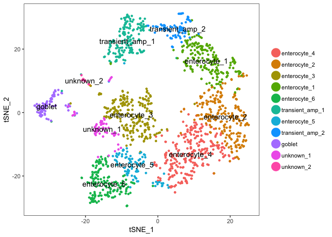
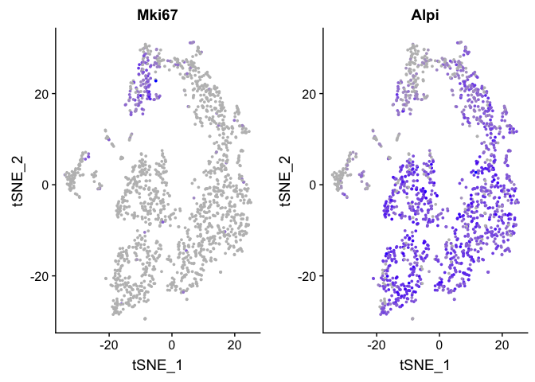
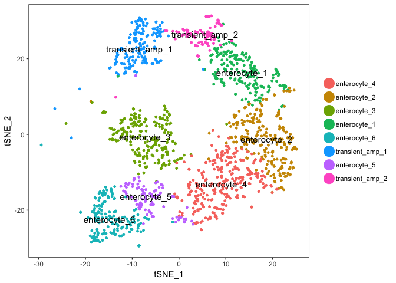
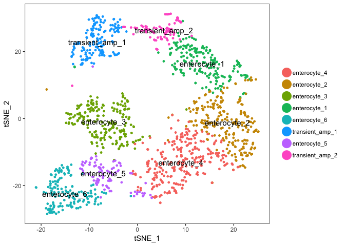

02\_Seurat\_processing
================

Load Seurat file
----------------

generated in [01\_prepare\_scrnaseq\_data](01_prepare_scrnaseq_data.md).

``` r
load(file = "./raw_data/csc.combined_seurat.Rda")
TSNEPlot(object = csc.combined,do.label = TRUE)
```



Filtering
---------

Choose enterocyte and transient amplifying clusters based on Mki67 and Alpi expression.

``` r
FeaturePlot(object = csc.combined, features.plot = c("Mki67","Alpi"), cols.use = c("grey", "blue"), 
            reduction.use = "tsne")
```



``` r
entcrypt.subset <- SubsetData(object = csc.combined, ident.use = c("enterocyte_1", "enterocyte_2","enterocyte_3","enterocyte_4","enterocyte_5","enterocyte_6","transient_amp_1","transient_amp_2"))
TSNEPlot(object = entcrypt.subset,do.label = TRUE)
```



Filter remaining goblet, paneth and tuft cells that were mis-clustered based on expression of Muc2 and Hepacam2 (Goblet markers), Dclk1 (tuft marker) and Lyz1 (Paneth marke).

``` r
entcrypt.subset.filt <- FilterCells(object = entcrypt.subset, subset.names = c("Muc2", "Dclk1","Hepacam2","Lyz1"), 
                    low.thresholds = c(-Inf, -Inf,-Inf, -Inf), high.thresholds = c(2, 1,1.5,4.5))   #hepacam2 expressed in goblet cells
TSNEPlot(object = entcrypt.subset.filt,do.label = TRUE)
```



Export resulting dataset
------------------------

``` r
all_cells<-entcrypt.subset.filt@raw.data@Dimnames[[2]]
used_cells<-entcrypt.subset.filt@data@Dimnames[[2]]
int<-data.table(csc.combined@raw.data)
overlap<-all_cells %in% used_cells
mat <- data.table(as.matrix(csc.combined@raw.data))
dim(mat)
```

    ## [1] 27998  1756

``` r
mat_filtered<-mat[, overlap, with=FALSE]
dim(mat_filtered)
```

    ## [1] 27998  1383

``` r
write.table(mat_filtered,file="./raw_data/CSC_dataset_seurat_raw.data_export_171212.txt",row.names = F,quote = F)

genes<-entcrypt.subset.filt@data@Dimnames[[1]]
str(genes)
```

    ##  chr [1:27998] "Xkr4" "Gm1992" "Gm37381" "Rp1" "Rp1.1" "Sox17" ...

``` r
write.table(genes,file="./raw_data/CSC_dataset_seurat_genes_export_171212.txt",row.names = F,quote = F,col.names = F)

tsne<-data.frame(entcrypt.subset.filt@dr$tsne@cell.embeddings)
setDT(tsne, keep.rownames = TRUE)[]
```

    ##                     rn     tSNE_1   tSNE_2
    ##    1: AAACGGGTCACTGGGC 13.6228916 16.82809
    ##    2: AAAGATGGTTCGGGCT  6.7542200 20.79126
    ##    3: AAAGCAACATGGTCAT 20.0901252 14.94035
    ##    4: AAAGTAGGTTGTGGAG 15.3180028 17.47779
    ##    5: AACCGCGCAAGCGTAG 15.8050001 17.20207
    ##   ---                                     
    ## 1379: TGAGCATCACGCTTTC  0.6444344 26.06162
    ## 1380: TGGCTGGAGTCTCAAC  0.8508661 27.76111
    ## 1381: TGGCTGGTCATGTCCC  7.7301170 28.46078
    ## 1382: TGGGCGTAGGTGCTAG  4.1431734 20.61691
    ## 1383: TTTACTGAGTCTCAAC  1.8795288 27.43944

``` r
ident<-data.frame(entcrypt.subset.filt@ident)
setDT(ident, keep.rownames = TRUE)[]
```

    ##                     rn entcrypt.subset.filt.ident
    ##    1: AAACGGGTCACTGGGC               enterocyte_1
    ##    2: AAAGATGGTTCGGGCT               enterocyte_1
    ##    3: AAAGCAACATGGTCAT               enterocyte_1
    ##    4: AAAGTAGGTTGTGGAG               enterocyte_1
    ##    5: AACCGCGCAAGCGTAG               enterocyte_1
    ##   ---                                            
    ## 1379: TGAGCATCACGCTTTC            transient_amp_2
    ## 1380: TGGCTGGAGTCTCAAC            transient_amp_2
    ## 1381: TGGCTGGTCATGTCCC            transient_amp_2
    ## 1382: TGGGCGTAGGTGCTAG            transient_amp_2
    ## 1383: TTTACTGAGTCTCAAC            transient_amp_2

``` r
df<-dplyr::inner_join(tsne,ident,by="rn")
df_ordered<-df[match(colnames(mat_filtered),df$rn),]
write.table(df_ordered,file="./raw_data/CSC_dataset_seurat_tsne_export_171212.txt",row.names = F,quote = F)

save(entcrypt.subset.filt, file = "./raw_data/entcrypt.subset.filt.Rda")
```

``` r
sessionInfo()
```

    ## R version 3.5.0 (2018-04-23)
    ## Platform: x86_64-apple-darwin15.6.0 (64-bit)
    ## Running under: macOS Sierra 10.12.6
    ## 
    ## Matrix products: default
    ## BLAS: /Library/Frameworks/R.framework/Versions/3.5/Resources/lib/libRblas.0.dylib
    ## LAPACK: /Library/Frameworks/R.framework/Versions/3.5/Resources/lib/libRlapack.dylib
    ## 
    ## locale:
    ## [1] en_US.UTF-8/en_US.UTF-8/en_US.UTF-8/C/en_US.UTF-8/en_US.UTF-8
    ## 
    ## attached base packages:
    ## [1] stats     graphics  grDevices utils     datasets  methods   base     
    ## 
    ## other attached packages:
    ## [1] bindrcpp_0.2.2    data.table_1.11.4 dplyr_0.7.6       Seurat_2.3.4     
    ## [5] Matrix_1.2-14     cowplot_0.9.3     ggplot2_3.0.0    
    ## 
    ## loaded via a namespace (and not attached):
    ##   [1] Rtsne_0.13          colorspace_1.3-2    class_7.3-14       
    ##   [4] modeltools_0.2-22   ggridges_0.5.0      mclust_5.4.1       
    ##   [7] rprojroot_1.3-2     htmlTable_1.12      base64enc_0.1-3    
    ##  [10] rstudioapi_0.7      proxy_0.4-22        flexmix_2.3-14     
    ##  [13] bit64_0.9-7         mvtnorm_1.0-8       codetools_0.2-15   
    ##  [16] splines_3.5.0       R.methodsS3_1.7.1   robustbase_0.93-2  
    ##  [19] knitr_1.20          Formula_1.2-3       jsonlite_1.5       
    ##  [22] packrat_0.4.9-3     ica_1.0-2           cluster_2.0.7-1    
    ##  [25] kernlab_0.9-26      png_0.1-7           R.oo_1.22.0        
    ##  [28] compiler_3.5.0      httr_1.3.1          backports_1.1.2    
    ##  [31] assertthat_0.2.0    lazyeval_0.2.1      lars_1.2           
    ##  [34] acepack_1.4.1       htmltools_0.3.6     tools_3.5.0        
    ##  [37] igraph_1.2.2        gtable_0.2.0        glue_1.3.0         
    ##  [40] RANN_2.6            reshape2_1.4.3      Rcpp_0.12.18       
    ##  [43] trimcluster_0.1-2.1 gdata_2.18.0        ape_5.1            
    ##  [46] nlme_3.1-137        iterators_1.0.10    fpc_2.1-11.1       
    ##  [49] gbRd_0.4-11         lmtest_0.9-36       stringr_1.3.1      
    ##  [52] irlba_2.3.2         gtools_3.8.1        DEoptimR_1.0-8     
    ##  [55] MASS_7.3-50         zoo_1.8-3           scales_0.5.0       
    ##  [58] doSNOW_1.0.16       parallel_3.5.0      RColorBrewer_1.1-2 
    ##  [61] yaml_2.2.0          reticulate_1.9      pbapply_1.3-4      
    ##  [64] gridExtra_2.3       rpart_4.1-13        segmented_0.5-3.0  
    ##  [67] latticeExtra_0.6-28 stringi_1.2.4       foreach_1.4.4      
    ##  [70] checkmate_1.8.5     caTools_1.17.1.1    bibtex_0.4.2       
    ##  [73] Rdpack_0.8-0        SDMTools_1.1-221    rlang_0.2.1        
    ##  [76] pkgconfig_2.0.1     dtw_1.20-1          prabclus_2.2-6     
    ##  [79] bitops_1.0-6        evaluate_0.11       lattice_0.20-35    
    ##  [82] ROCR_1.0-7          purrr_0.2.5         bindr_0.1.1        
    ##  [85] labeling_0.3        htmlwidgets_1.2     bit_1.1-14         
    ##  [88] tidyselect_0.2.4    plyr_1.8.4          magrittr_1.5       
    ##  [91] R6_2.2.2            snow_0.4-2          gplots_3.0.1       
    ##  [94] Hmisc_4.1-1         pillar_1.3.0        foreign_0.8-70     
    ##  [97] withr_2.1.2         fitdistrplus_1.0-9  mixtools_1.1.0     
    ## [100] survival_2.42-4     nnet_7.3-12         tibble_1.4.2       
    ## [103] tsne_0.1-3          crayon_1.3.4        hdf5r_1.0.0        
    ## [106] KernSmooth_2.23-15  rmarkdown_1.10      grid_3.5.0         
    ## [109] metap_1.0           digest_0.6.15       diptest_0.75-7     
    ## [112] tidyr_0.8.1         R.utils_2.6.0       stats4_3.5.0       
    ## [115] munsell_0.5.0
