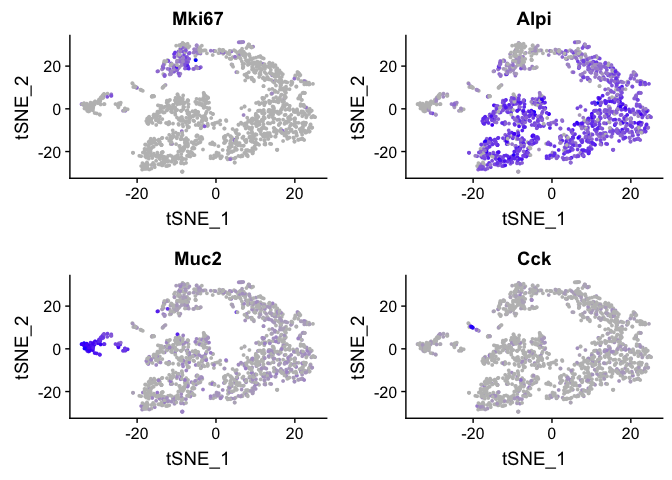
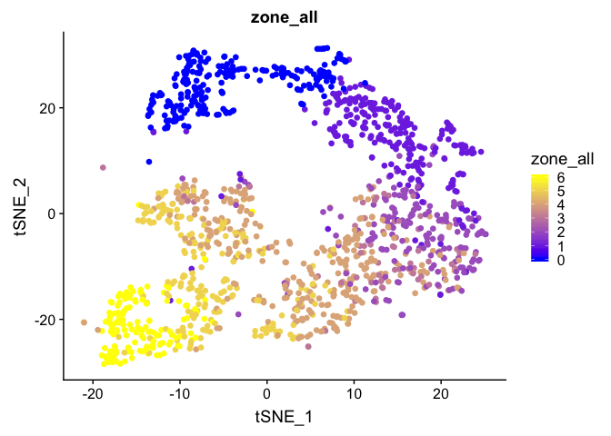
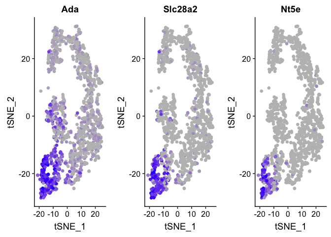
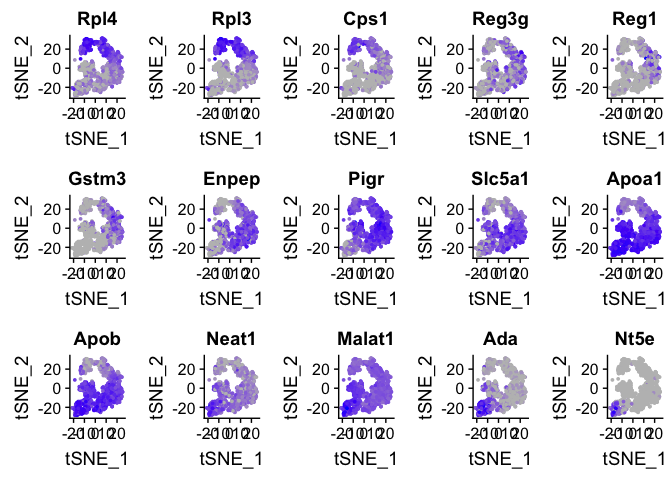
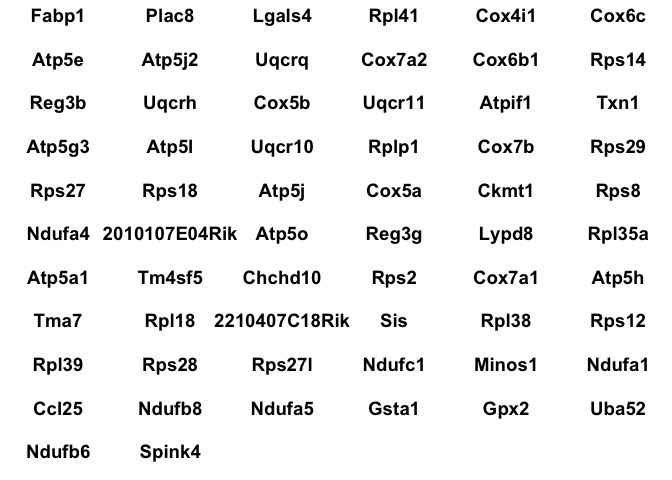
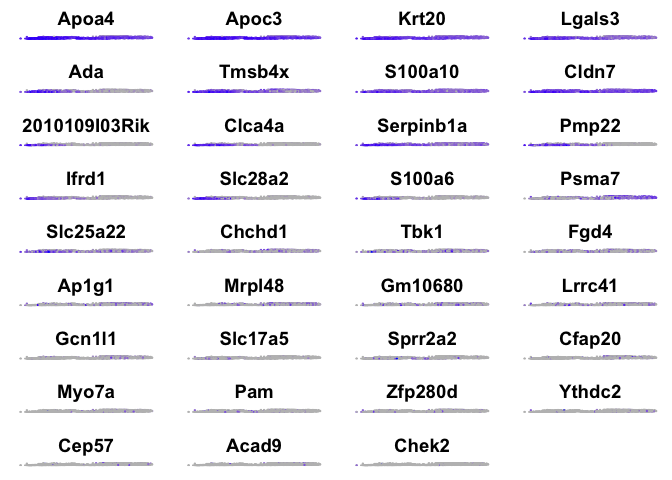

04\_figures\_R
================

Load dataset
------------

CSC combined generated in [01\_prepare\_scrnaseq\_data](01_prepare_scrnaseq_data.md). Enterocyte subset is generated in [02\_Seurat\_processing](02_Seurat_processing.md).

``` r
load(file = "./raw_data/csc.combined_seurat.Rda")
load(file = "./raw_data/entcrypt.subset.filt.Rda")
```

Plot marker genes for enterocyte cluster election
-------------------------------------------------

Figure S1C

``` r
FeaturePlot(object = csc.combined, features.plot = c("Mki67","Alpi","Muc2","Cck"), cols.use = c("grey", "blue"), 
            reduction.use = "tsne")
```



``` r
ggsave(file="./figures/supplement/FigS1C_tsne_marker_genes.pdf",plot=last_plot(),width=6.5,height=6)
```

Add zonation reconstruction for plotting
----------------------------------------

``` r
zone_table<-read.delim(file="./raw_data/cell_zone_table.txt",header = T)
rownames(zone_table)<-zone_table$cell_id

temp <- AddMetaData(entcrypt.subset.filt, select(zone_table,zone)) 
temp<-temp@meta.data%>%mutate(cell_id=rownames(.),zone_all=ifelse(is.na(zone),0,zone))   #set zone of crypt cells to 0, they did not undergo zonation reconstruction.

rownames(temp)<-temp$cell_id
new <- AddMetaData(entcrypt.subset.filt, select(temp,zone_all))
FeaturePlot(object = new, features.plot = c("zone_all"), cols.use = c("blue","yellow"), pt.size=2,no.legend = F,
            reduction.use = "tsne")
```



``` r
ggsave(file="./figures/main/Fig2D_tsne_reconstruction.pdf",plot=last_plot(),width=6.5,height=6)
```

Expression plots
----------------

``` r
FeaturePlot(object = entcrypt.subset.filt, features.plot = c("Ada","Slc28a2","Nt5e"),nCol = 3, pt.size = 2, cols.use = c("grey", "blue"), 
            reduction.use = "tsne")
```



``` r
ggsave(file="./figures/main/Fig6C_tsne_tip_genes.pdf",plot=last_plot(),width=12,height=4)

FeaturePlot(object = entcrypt.subset.filt, features.plot = c("Rpl4","Rpl3","Cps1","Reg3g","Reg1","Gstm3","Enpep","Pigr","Slc5a1","Apoa1","Apob","Neat1","Malat1","Ada","Nt5e"),nCol = 5, cols.use = c("grey", "blue"), 
            reduction.use = "tsne")
```



``` r
ggsave(file="./figures/supplement/FigS2F_tsnes_supp.pdf",plot=last_plot(),width=12,height=7)
```

``` r
#remove crypt clusters
noncrypt <- SubsetData(object = entcrypt.subset.filt, ident.use = c("enterocyte_1", "enterocyte_2","enterocyte_3","enterocyte_4","enterocyte_5","enterocyte_6"))


#identify all genes that are expressed in more than 10 enterocytes
genes.use <- rownames(noncrypt@data)

num.cells <- rowSums(noncrypt@data > 0)
genes.use <- names(num.cells[which(num.cells >= 10)])


#set all cluster ids identical to perform average expression function
current.cluster.ids <- c("enterocyte_1", "enterocyte_2","enterocyte_3","enterocyte_4","enterocyte_5","enterocyte_6")
new.cluster.ids <- c("all","all","all","all","all","all")
noncrypt@ident <- plyr::mapvalues(x = noncrypt@ident, from = current.cluster.ids, to = new.cluster.ids)

expression<-AverageExpression(noncrypt)
```

    ## Finished averaging RNA for cluster all

``` r
expression$gene<-rownames(expression)

#landmark genes 

bottom_landmark<-c("2010107E04Rik", "2210407C18Rik", "Atp5a1", "Atp5e", "Atp5g3", "Atp5h", "Atp5j",
                   "Atp5j2", "Atp5l", "Atp5o", "Atpif1", "Ccl25", "Chchd10", "Ckmt1", "Cox4i1", "Cox5a",
                   "Cox5b", "Cox6b1", "Cox6c", "Cox7a1", "Cox7a2", "Cox7b", "Fabp1", "Gpx2", "Gsta1", "Lgals4", 
                   "Lypd8", "Minos1", "Ndufa1", "Ndufa4", "Ndufa5", "Ndufb6", "Ndufb8", "Ndufc1", "Plac8", "Reg3b", 
                   "Reg3g", "Rpl18", "Rpl35a", "Rpl38", "Rpl39", "Rpl41", "Rplp1", "Rps12", "Rps14", "Rps18", "Rps2", 
                  "Rps27", "Rps27l", "Rps28", "Rps29", "Rps8", "Sis", "Spink4", "Tm4sf5", "Tma7",
                   "Txn1", "Uba52", "Uqcr10", "Uqcr11", "Uqcrh", "Uqcrq")


top_landmark<-c("2010109I03Rik", "Acad9", "Ada", "Ap1g1", "Apoa4", "Apoc3", "Cep57", "Cfap20", "Chchd1",
                "Chek2", "Clca4a", "Cldn7", "Fgd4", "Gcn1l1", "Glipr1", "Gm10680", "Gm20594", "Ifrd1",
                "Krt20", "Lgals3", "Lrrc41", "Mrpl48", "Myo7a", "Olfr1385", "Olfr46", "Pam", "Pkib", "Pmp22",
                "Psma7", "Rab34", "S100a10", "S100a6", "Serpinb1a", "Slc17a5", "Slc25a22", "Slc28a2", "Sprr2a2",
                "Ssbp2", "Tbk1", "Tlr1", "Tmsb4x", "Ythdc2", "Zfp280d")


filt_bottom<-intersect(bottom_landmark,genes.use)%>%
  as.data.frame()
colnames(filt_bottom)<-"gene"
bottom_join<-inner_join(filt_bottom,expression)%>%
  arrange(desc(all))
```

    ## Joining, by = "gene"

    ## Warning: Column `gene` joining factor and character vector, coercing into
    ## character vector

``` r
bottom<-as.character(bottom_join$gene)


filt_top<-intersect(top_landmark,genes.use)%>%
  as.data.frame()
colnames(filt_top)<-"gene"
top_join<-inner_join(filt_top,expression)%>%
  arrange(desc(all))
```

    ## Joining, by = "gene"

    ## Warning: Column `gene` joining factor and character vector, coercing into
    ## character vector

``` r
top<-as.character(top_join$gene)


FeaturePlot(object = noncrypt, features.plot = bottom, nCol = 6, cols.use = c("grey", "blue"), 
            reduction.use = "tsne",no.legend = T,no.axes = T,pt.size = 0.5)
```



``` r
ggsave(file="./figures/supplement/FigS1F_tsne_landmark_bottom.pdf",plot=last_plot(),width=7,height=11)


FeaturePlot(object = noncrypt, features.plot = top, nCol = 4, cols.use = c("grey", "blue"), 
            reduction.use = "tsne",no.legend = T,no.axes = T,pt.size = 0.5)
```



``` r
ggsave(file="./figures/supplement/FigS1G_tsne_landmark_tip.pdf",plot=last_plot(),width=5.3,height=9)
```

Produce supplementary datasets
------------------------------

``` r
library(data.table)
```

    ## 
    ## Attaching package: 'data.table'

    ## The following objects are masked from 'package:dplyr':
    ## 
    ##     between, first, last

``` r
all_cells<-entcrypt.subset.filt@raw.data@Dimnames[[2]]
used_cells<-entcrypt.subset.filt@data@Dimnames[[2]]
int<-data.table(csc.combined@raw.data)
overlap<-all_cells %in% used_cells
mat <- data.table(as.matrix(csc.combined@raw.data))
dim(mat)
```

    ## [1] 27998  1756

``` r
mat_filtered<-mat[, overlap, with=FALSE]
dim(mat_filtered)
```

    ## [1] 27998  1383

``` r
genes<-entcrypt.subset.filt@data@Dimnames[[1]]


tsne<-data.frame(entcrypt.subset.filt@dr$tsne@cell.embeddings)
setDT(tsne, keep.rownames = TRUE)[]
```

    ##                     rn     tSNE_1   tSNE_2
    ##    1: AAACGGGTCACTGGGC 13.6228916 16.82809
    ##    2: AAAGATGGTTCGGGCT  6.7542200 20.79126
    ##    3: AAAGCAACATGGTCAT 20.0901252 14.94035
    ##    4: AAAGTAGGTTGTGGAG 15.3180028 17.47779
    ##    5: AACCGCGCAAGCGTAG 15.8050001 17.20207
    ##   ---                                     
    ## 1379: TGAGCATCACGCTTTC  0.6444344 26.06162
    ## 1380: TGGCTGGAGTCTCAAC  0.8508661 27.76111
    ## 1381: TGGCTGGTCATGTCCC  7.7301170 28.46078
    ## 1382: TGGGCGTAGGTGCTAG  4.1431734 20.61691
    ## 1383: TTTACTGAGTCTCAAC  1.8795288 27.43944

``` r
ident<-data.frame(entcrypt.subset.filt@ident)
setDT(ident, keep.rownames = TRUE)[]
```

    ##                     rn entcrypt.subset.filt.ident
    ##    1: AAACGGGTCACTGGGC               enterocyte_1
    ##    2: AAAGATGGTTCGGGCT               enterocyte_1
    ##    3: AAAGCAACATGGTCAT               enterocyte_1
    ##    4: AAAGTAGGTTGTGGAG               enterocyte_1
    ##    5: AACCGCGCAAGCGTAG               enterocyte_1
    ##   ---                                            
    ## 1379: TGAGCATCACGCTTTC            transient_amp_2
    ## 1380: TGGCTGGAGTCTCAAC            transient_amp_2
    ## 1381: TGGCTGGTCATGTCCC            transient_amp_2
    ## 1382: TGGGCGTAGGTGCTAG            transient_amp_2
    ## 1383: TTTACTGAGTCTCAAC            transient_amp_2

``` r
df<-dplyr::inner_join(tsne,ident,by="rn")
df_ordered<-df[match(colnames(mat_filtered),df$rn),]

cell_ids<-entcrypt.subset.filt@data@Dimnames[[2]]
str(cell_ids)
```

    ##  chr [1:1383] "AAACGGGTCACTGGGC" "AAAGATGGTTCGGGCT" "AAAGCAACATGGTCAT" ...

``` r
mat_export<-mat_filtered
colnames(mat_export)<-cell_ids
row.names(mat_export)<-genes
mat_export$gene<-genes
mat_export <- mat_export[, c(1384, 1:1383)]
write.table(mat_export,file="./tables/scRNAseq_UMI_table.tsv",row.names = F,quote = F,sep="\t")

tsne_export<-df_ordered
colnames(tsne_export)<-c("cell_id","tSNE_coordinate_1","tSNE_coordinate_2","cluster_id")
tsne_export_new<-left_join(tsne_export,zone_table)%>%select(-4)
```

    ## Joining, by = "cell_id"

    ## Warning: Column `cell_id` joining character vector and factor, coercing
    ## into character vector

``` r
lookup_table<-data.table(zone=c(1,2,3,4,5,6,NA),new_id=c("V1","V2","V3","V4","V5","V6","Crypt"))
tsne_export_new_updated<-left_join(tsne_export_new,lookup_table)%>%select(-4)%>%rename("zone"="new_id")
```

    ## Joining, by = "zone"

``` r
write.table(tsne_export_new_updated,file="./tables/scRNAseq_tsne_coordinates_zones.tsv",row.names = F,quote = F,sep="\t")
```

``` r
sessionInfo()
```

    ## R version 3.5.0 (2018-04-23)
    ## Platform: x86_64-apple-darwin15.6.0 (64-bit)
    ## Running under: macOS Sierra 10.12.6
    ## 
    ## Matrix products: default
    ## BLAS: /Library/Frameworks/R.framework/Versions/3.5/Resources/lib/libRblas.0.dylib
    ## LAPACK: /Library/Frameworks/R.framework/Versions/3.5/Resources/lib/libRlapack.dylib
    ## 
    ## locale:
    ## [1] en_US.UTF-8/en_US.UTF-8/en_US.UTF-8/C/en_US.UTF-8/en_US.UTF-8
    ## 
    ## attached base packages:
    ## [1] stats     graphics  grDevices utils     datasets  methods   base     
    ## 
    ## other attached packages:
    ## [1] data.table_1.11.4 bindrcpp_0.2.2    Seurat_2.3.4      Matrix_1.2-14    
    ## [5] cowplot_0.9.3     ggplot2_3.0.0     dplyr_0.7.6      
    ## 
    ## loaded via a namespace (and not attached):
    ##   [1] Rtsne_0.13          colorspace_1.3-2    class_7.3-14       
    ##   [4] modeltools_0.2-22   ggridges_0.5.0      mclust_5.4.1       
    ##   [7] rprojroot_1.3-2     htmlTable_1.12      base64enc_0.1-3    
    ##  [10] rstudioapi_0.7      proxy_0.4-22        flexmix_2.3-14     
    ##  [13] bit64_0.9-7         mvtnorm_1.0-8       codetools_0.2-15   
    ##  [16] splines_3.5.0       R.methodsS3_1.7.1   robustbase_0.93-2  
    ##  [19] knitr_1.20          Formula_1.2-3       jsonlite_1.5       
    ##  [22] packrat_0.4.9-3     ica_1.0-2           cluster_2.0.7-1    
    ##  [25] kernlab_0.9-26      png_0.1-7           R.oo_1.22.0        
    ##  [28] compiler_3.5.0      httr_1.3.1          backports_1.1.2    
    ##  [31] assertthat_0.2.0    lazyeval_0.2.1      lars_1.2           
    ##  [34] acepack_1.4.1       htmltools_0.3.6     tools_3.5.0        
    ##  [37] igraph_1.2.2        gtable_0.2.0        glue_1.3.0         
    ##  [40] RANN_2.6            reshape2_1.4.3      Rcpp_0.12.18       
    ##  [43] trimcluster_0.1-2.1 gdata_2.18.0        ape_5.1            
    ##  [46] nlme_3.1-137        iterators_1.0.10    fpc_2.1-11.1       
    ##  [49] gbRd_0.4-11         lmtest_0.9-36       stringr_1.3.1      
    ##  [52] irlba_2.3.2         gtools_3.8.1        DEoptimR_1.0-8     
    ##  [55] MASS_7.3-50         zoo_1.8-3           scales_0.5.0       
    ##  [58] doSNOW_1.0.16       parallel_3.5.0      RColorBrewer_1.1-2 
    ##  [61] yaml_2.2.0          reticulate_1.9      pbapply_1.3-4      
    ##  [64] gridExtra_2.3       rpart_4.1-13        segmented_0.5-3.0  
    ##  [67] latticeExtra_0.6-28 stringi_1.2.4       foreach_1.4.4      
    ##  [70] checkmate_1.8.5     caTools_1.17.1.1    bibtex_0.4.2       
    ##  [73] Rdpack_0.8-0        SDMTools_1.1-221    rlang_0.2.1        
    ##  [76] pkgconfig_2.0.1     dtw_1.20-1          prabclus_2.2-6     
    ##  [79] bitops_1.0-6        evaluate_0.11       lattice_0.20-35    
    ##  [82] ROCR_1.0-7          purrr_0.2.5         bindr_0.1.1        
    ##  [85] labeling_0.3        htmlwidgets_1.2     bit_1.1-14         
    ##  [88] tidyselect_0.2.4    plyr_1.8.4          magrittr_1.5       
    ##  [91] R6_2.2.2            snow_0.4-2          gplots_3.0.1       
    ##  [94] Hmisc_4.1-1         pillar_1.3.0        foreign_0.8-70     
    ##  [97] withr_2.1.2         fitdistrplus_1.0-9  mixtools_1.1.0     
    ## [100] survival_2.42-4     nnet_7.3-12         tibble_1.4.2       
    ## [103] tsne_0.1-3          crayon_1.3.4        hdf5r_1.0.0        
    ## [106] KernSmooth_2.23-15  rmarkdown_1.10      grid_3.5.0         
    ## [109] metap_1.0           digest_0.6.15       diptest_0.75-7     
    ## [112] tidyr_0.8.1         R.utils_2.6.0       stats4_3.5.0       
    ## [115] munsell_0.5.0
