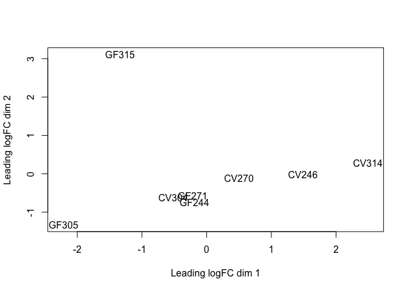
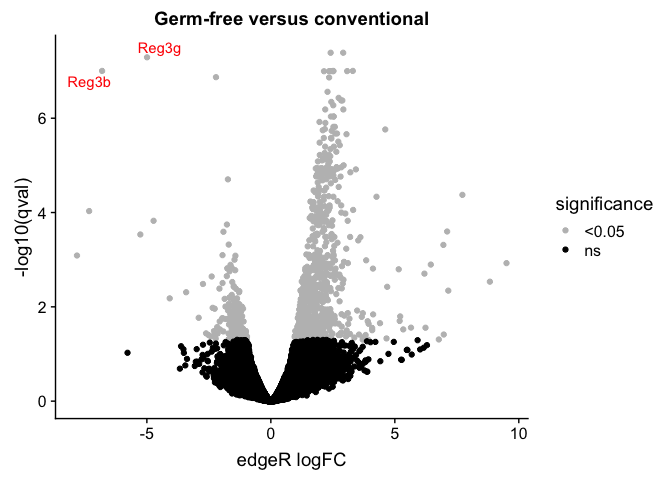
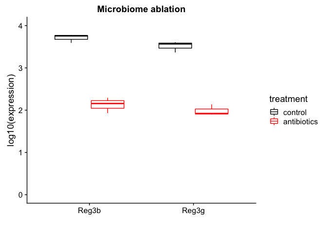
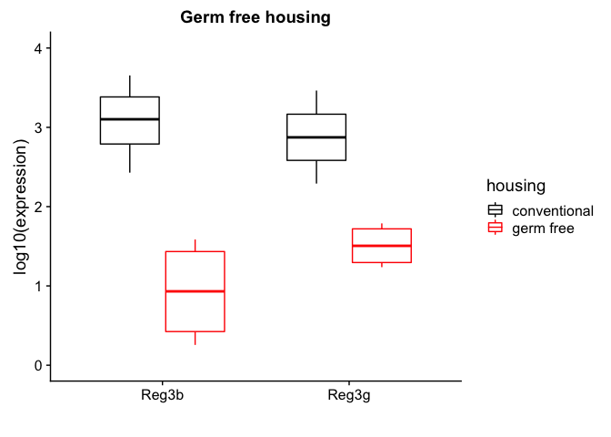

07\_rnaseq\_germfree\_antibiotics
================

``` r
knitr::opts_chunk$set(echo = TRUE)
library(dplyr)
library(tidyr)
library(edgeR)
library(readr)
library(data.table)
library(readxl)
library(ggbeeswarm)
library(cowplot)
```

Germ free RNAseq analysis
-------------------------

Retrieve and unzip count table from [GEO](https://www.ncbi.nlm.nih.gov/geo/download/?acc=GSE81125&format=file&file=GSE81125%5FSTAR%5FSALMON%5FCVGF%5FCounts%2Ecsv%2Egz).

``` r
all_matrix <- read.csv("./raw_data/GSE81125_STAR_SALMON_CVGF_Counts.csv", row.names=1)
```

Import ensembl annotation

``` r
load(file="./raw_data/annotation_v90.dat")
```

use EdgeR for normalization, create a CPM table and test for differential gene expression

``` r
group <- c(1,1,1,1,2,2,2,2)
y <- DGEList(counts=all_matrix, group=group)
y$samples
```

    ##       group lib.size norm.factors
    ## CV246     1 14093045            1
    ## CV270     1  9817549            1
    ## CV304     1  9330292            1
    ## CV314     1 14093373            1
    ## GF244     2 11808406            1
    ## GF271     2 10668119            1
    ## GF305     2  7968745            1
    ## GF315     2  9621067            1

``` r
keep <- rowSums(cpm(y)>1) >= 2
y <- y[keep, , keep.lib.sizes=FALSE]

y <- calcNormFactors(y)
plotMDS(y)
```



``` r
y <- estimateDisp(y)
```

    ## Design matrix not provided. Switch to the classic mode.

``` r
y <- estimateTagwiseDisp(y)
et <- exactTest(y,pair=1:2)

topTags(et)
```

    ## Comparison of groups:  2-1 
    ##                           logFC   logCPM       PValue          FDR
    ## ENSMUSG00000043079.17  2.917281 5.135817 1.879616e-12 4.087414e-08
    ## ENSMUSG00000070565.11  2.411672 5.283206 3.760772e-12 4.089087e-08
    ## ENSMUSG00000030017.2  -4.992794 9.257689 7.043047e-12 5.105270e-08
    ## ENSMUSG00000071356.7  -6.806360 9.896243 2.297310e-11 9.929718e-08
    ## ENSMUSG00000053852.11  2.517733 6.611101 2.651179e-11 9.929718e-08
    ## ENSMUSG00000038370.6   3.306235 4.423914 2.739736e-11 9.929718e-08
    ## ENSMUSG00000032285.15  2.520852 6.493650 4.261247e-11 1.002041e-07
    ## ENSMUSG00000062444.14  2.348765 4.913605 4.309817e-11 1.002041e-07
    ## ENSMUSG00000027220.2   2.426029 6.961579 4.833341e-11 1.002041e-07
    ## ENSMUSG00000031144.15  2.505248 6.591117 4.888520e-11 1.002041e-07

``` r
my.DGEList.processed = topTags(et, n = nrow(y$data),adjust.method = "fdr")
ta<-my.DGEList.processed$table%>%mutate(gene=row.names(.))

cpm<-cpm(y)%>%as.data.frame(.)%>%mutate(gene=row.names(.))

gf_cpm_table<-cpm%>%
  mutate(ensembl_gene_id=gsub("\\..*","",gene))%>%
  left_join(gene_ids)
```

    ## Joining, by = "ensembl_gene_id"

``` r
gf_edger_dge<-my.DGEList.processed$table%>%mutate(ensembl_gene_id=gsub("\\..*","",row.names(.)))%>%
  left_join(gene_ids)
```

    ## Joining, by = "ensembl_gene_id"

Antibiotic treatment data
-------------------------

Retrieve and CPM table from [GEO](ftp://ftp.ncbi.nlm.nih.gov/geo/series/GSE74nnn/GSE74157/suppl/GSE74157_jejunum_normalized_counts_cpm.xlsx).

``` r
antibio <- read_excel("~/Box Sync/Projects/villus_cell_atlas/raw_files/GSE74157_jejunum_normalized_counts_cpm.xlsx")
antibio_spread<-gather(antibio,key=sample,value=expression,-c(geneName))%>%
  mutate(treatment=ifelse(sample=="RT1"|sample=="RT2"|sample=="RT3","control",ifelse(sample=="RAB1"|sample=="RAB2"|sample=="RAB3","exp","")))%>%
  filter(treatment=="exp"|treatment=="control")%>%
  filter(geneName=="Reg3b"|geneName=="Reg3g")%>%
  mutate(experiment="ablation")


library("ggrepel") #Avoid overlapping labels
mutateddf <- mutate(gf_edger_dge, significance=ifelse(FDR<0.05, "<0.05", "ns"))%>%na.omit(.) #Will have different colors depending on significance
volcano<-ggplot(mutateddf, aes(logFC, -log10(FDR))) + #volcanoplot with bias versus qval
  geom_point(aes(col=significance)) + #add points colored by significance
  scale_color_manual(values=c("grey", "black")) + 
  ggtitle("Germ-free versus conventional")+
  xlab("edgeR logFC")+ylab("-log10(qval)")+
  geom_text_repel(data=filter(mutateddf,external_gene_name=="Reg3b"| external_gene_name=="Reg3g"),
                  aes(label=external_gene_name),color="red")
print(volcano)
```



``` r
#figure 4d
save_plot("./figures/main/Fig4d_volcano_germfree.pdf", volcano,base_height=8 )


gf<-gather(select(gf_cpm_table,1:8,11),key=sample,value=expression,-c(external_gene_name))%>%
  mutate(treatment=ifelse(substr(sample, start = 1, stop = 2)=="GF","exp","control"))%>%
  mutate(experiment="housing")%>%
  filter(external_gene_name=="Reg3b"|external_gene_name=="Reg3g")%>%
  rename(geneName=external_gene_name)


abx<-ggplot(antibio_spread, 
       aes(geneName, log10(expression), 
           color=factor(treatment,labels = c("control","antibiotics")))) + 
  geom_boxplot(width=0.7)+
  scale_color_manual("treatment",values=c("black","red"))+
  ggtitle("Microbiome ablation")+
  xlab("")+
  coord_cartesian(ylim = c(0, 4)) 
print(abx)
```



``` r
germfree<-ggplot(gf, 
       aes(geneName, log10(expression), 
           color=factor(treatment,labels = c("control","exp")))) + 
  geom_boxplot(width=0.7)+
  scale_color_manual("housing",values=c("black","red"),labels=c("conventional","germ free"))+
  ggtitle("Germ free housing")+
  xlab("")+
  coord_cartesian(ylim = c(0, 4)) 
print(germfree)
```



``` r
#figure 4 ef
save_plot("./figures/main/Fig4ef_boxplots.pdf", 
          plot_grid(germfree,abx,align = "h",ncol = 2),base_aspect_ratio = 2 )
```

``` r
sessionInfo()
```

    ## R version 3.5.0 (2018-04-23)
    ## Platform: x86_64-apple-darwin15.6.0 (64-bit)
    ## Running under: macOS Sierra 10.12.6
    ## 
    ## Matrix products: default
    ## BLAS: /Library/Frameworks/R.framework/Versions/3.5/Resources/lib/libRblas.0.dylib
    ## LAPACK: /Library/Frameworks/R.framework/Versions/3.5/Resources/lib/libRlapack.dylib
    ## 
    ## locale:
    ## [1] en_US.UTF-8/en_US.UTF-8/en_US.UTF-8/C/en_US.UTF-8/en_US.UTF-8
    ## 
    ## attached base packages:
    ## [1] stats     graphics  grDevices utils     datasets  methods   base     
    ## 
    ## other attached packages:
    ##  [1] ggrepel_0.8.0     bindrcpp_0.2.2    cowplot_0.9.3    
    ##  [4] ggbeeswarm_0.6.0  ggplot2_3.0.0     readxl_1.1.0     
    ##  [7] data.table_1.11.4 readr_1.1.1       edgeR_3.22.3     
    ## [10] limma_3.36.2      tidyr_0.8.1       dplyr_0.7.6      
    ## 
    ## loaded via a namespace (and not attached):
    ##  [1] Rcpp_0.12.18     vipor_0.4.5      plyr_1.8.4       pillar_1.3.0    
    ##  [5] compiler_3.5.0   cellranger_1.1.0 bindr_0.1.1      tools_3.5.0     
    ##  [9] digest_0.6.15    packrat_0.4.9-3  evaluate_0.11    tibble_1.4.2    
    ## [13] gtable_0.2.0     lattice_0.20-35  pkgconfig_2.0.1  rlang_0.2.1     
    ## [17] yaml_2.2.0       beeswarm_0.2.3   withr_2.1.2      stringr_1.3.1   
    ## [21] knitr_1.20       hms_0.4.2        locfit_1.5-9.1   rprojroot_1.3-2 
    ## [25] grid_3.5.0       tidyselect_0.2.4 glue_1.3.0       R6_2.2.2        
    ## [29] rmarkdown_1.10   purrr_0.2.5      magrittr_1.5     splines_3.5.0   
    ## [33] backports_1.1.2  scales_0.5.0     htmltools_0.3.6  assertthat_0.2.0
    ## [37] colorspace_1.3-2 labeling_0.3     stringi_1.2.4    lazyeval_0.2.1  
    ## [41] munsell_0.5.0    crayon_1.3.4
