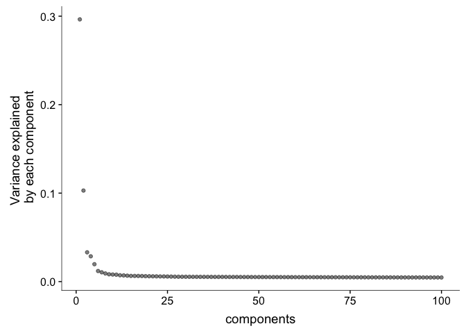

08\_pseudotime
================

``` r
knitr::opts_chunk$set(echo = TRUE)
library(monocle)
library(dplyr)
library(Seurat)
```

scRNAseq data
-------------

Retrieve filtered enterocyte scRNAseq data (generated in [02\_Seurat\_processing](02_Seurat_processing.md)).

``` r
load( file = "./raw_data/entcrypt.subset.filt.Rda")
```

Add zonation reconstruction
---------------------------

``` r
zone_table<-read.delim(file="./raw_data/cell_zone_table.txt",header = T)
rownames(zone_table)<-zone_table$cell_id

temp <- AddMetaData(entcrypt.subset.filt, select(zone_table,zone)) 
temp<-temp@meta.data%>%mutate(cell_id=rownames(.),reconstructed_zone=ifelse(is.na(zone),0,zone))   #set zone of crypt cells to 0, they did not undergo zonation reconstruction.

rownames(temp)<-temp$cell_id
new <- AddMetaData(entcrypt.subset.filt, select(temp,reconstructed_zone))
FeaturePlot(object = new, features.plot = c("reconstructed_zone"), cols.use = c("blue","yellow"), pt.size=2,no.legend = F,
            reduction.use = "tsne")
```


Monocle pseudotime analysis
---------------------------

``` r
monocle_obj<-importCDS(new)  


monocle_obj <- estimateSizeFactors(monocle_obj)
monocle_obj <- estimateDispersions(monocle_obj)
```

    ## Removing 45 outliers

``` r
monocle_obj<-monocle_obj
monocle_obj <- detectGenes(monocle_obj, min_expr = 0.1)

fData(monocle_obj)$use_for_ordering <-
  fData(monocle_obj)$num_cells_expressed > 0.05 * ncol(monocle_obj)


plot_pc_variance_explained(monocle_obj, return_all = F)
```



``` r
# 5 PCs chosen based on ellbow plot


set.seed(898343)
monocle_obj <- reduceDimension(monocle_obj, max_components = 5,
                            method = 'DDRTree')

monocle_obj <- orderCells(monocle_obj)

plot_cell_trajectory(monocle_obj, color_by = "reconstructed_zone",show_branch_points = F)
```


``` r
ggsave(file="./figures/main/Fig7c_monocle_pca.pdf",plot=last_plot(),width=6,height=5)
```

``` r
sessionInfo()
```

    ## R version 3.5.0 (2018-04-23)
    ## Platform: x86_64-apple-darwin15.6.0 (64-bit)
    ## Running under: macOS Sierra 10.12.6
    ## 
    ## Matrix products: default
    ## BLAS: /Library/Frameworks/R.framework/Versions/3.5/Resources/lib/libRblas.0.dylib
    ## LAPACK: /Library/Frameworks/R.framework/Versions/3.5/Resources/lib/libRlapack.dylib
    ## 
    ## locale:
    ## [1] en_US.UTF-8/en_US.UTF-8/en_US.UTF-8/C/en_US.UTF-8/en_US.UTF-8
    ## 
    ## attached base packages:
    ##  [1] splines   stats4    parallel  stats     graphics  grDevices utils    
    ##  [8] datasets  methods   base     
    ## 
    ## other attached packages:
    ##  [1] bindrcpp_0.2.2      Seurat_2.3.4        cowplot_0.9.3      
    ##  [4] dplyr_0.7.6         monocle_2.8.0       DDRTree_0.1.5      
    ##  [7] irlba_2.3.2         VGAM_1.0-5          ggplot2_3.0.0      
    ## [10] Biobase_2.40.0      BiocGenerics_0.26.0 Matrix_1.2-14      
    ## 
    ## loaded via a namespace (and not attached):
    ##   [1] snow_0.4-2             backports_1.1.2        Hmisc_4.1-1           
    ##   [4] plyr_1.8.4             igraph_1.2.2           lazyeval_0.2.1        
    ##   [7] densityClust_0.3       fastICA_1.2-1          digest_0.6.15         
    ##  [10] foreach_1.4.4          htmltools_0.3.6        viridis_0.5.1         
    ##  [13] lars_1.2               gdata_2.18.0           magrittr_1.5          
    ##  [16] checkmate_1.8.5        cluster_2.0.7-1        mixtools_1.1.0        
    ##  [19] ROCR_1.0-7             limma_3.36.2           matrixStats_0.54.0    
    ##  [22] R.utils_2.6.0          docopt_0.6             colorspace_1.3-2      
    ##  [25] ggrepel_0.8.0          sparsesvd_0.1-4        crayon_1.3.4          
    ##  [28] jsonlite_1.5           bindr_0.1.1            survival_2.42-4       
    ##  [31] zoo_1.8-3              iterators_1.0.10       ape_5.1               
    ##  [34] glue_1.3.0             gtable_0.2.0           kernlab_0.9-26        
    ##  [37] prabclus_2.2-6         DEoptimR_1.0-8         scales_0.5.0          
    ##  [40] pheatmap_1.0.10        mvtnorm_1.0-8          bibtex_0.4.2          
    ##  [43] Rcpp_0.12.18           metap_1.0              dtw_1.20-1            
    ##  [46] viridisLite_0.3.0      htmlTable_1.12         reticulate_1.9        
    ##  [49] foreign_0.8-70         bit_1.1-14             proxy_0.4-22          
    ##  [52] mclust_5.4.1           SDMTools_1.1-221       Formula_1.2-3         
    ##  [55] tsne_0.1-3             htmlwidgets_1.2        httr_1.3.1            
    ##  [58] FNN_1.1.2.1            gplots_3.0.1           RColorBrewer_1.1-2    
    ##  [61] fpc_2.1-11.1           acepack_1.4.1          modeltools_0.2-22     
    ##  [64] ica_1.0-2              pkgconfig_2.0.1        R.methodsS3_1.7.1     
    ##  [67] flexmix_2.3-14         nnet_7.3-12            labeling_0.3          
    ##  [70] tidyselect_0.2.4       rlang_0.2.1            reshape2_1.4.3        
    ##  [73] munsell_0.5.0          tools_3.5.0            ggridges_0.5.0        
    ##  [76] evaluate_0.11          stringr_1.3.1          yaml_2.2.0            
    ##  [79] knitr_1.20             bit64_0.9-7            fitdistrplus_1.0-9    
    ##  [82] robustbase_0.93-2      caTools_1.17.1.1       purrr_0.2.5           
    ##  [85] RANN_2.6               packrat_0.4.9-3        pbapply_1.3-4         
    ##  [88] nlme_3.1-137           slam_0.1-43            R.oo_1.22.0           
    ##  [91] hdf5r_1.0.0            compiler_3.5.0         rstudioapi_0.7        
    ##  [94] png_0.1-7              tibble_1.4.2           stringi_1.2.4         
    ##  [97] lattice_0.20-35        trimcluster_0.1-2.1    HSMMSingleCell_0.114.0
    ## [100] pillar_1.3.0           combinat_0.0-8         Rdpack_0.8-0          
    ## [103] lmtest_0.9-36          data.table_1.11.4      bitops_1.0-6          
    ## [106] gbRd_0.4-11            R6_2.2.2               latticeExtra_0.6-28   
    ## [109] KernSmooth_2.23-15     gridExtra_2.3          codetools_0.2-15      
    ## [112] MASS_7.3-50            gtools_3.8.1           assertthat_0.2.0      
    ## [115] rprojroot_1.3-2        withr_2.1.2            qlcMatrix_0.9.7       
    ## [118] diptest_0.75-7         doSNOW_1.0.16          grid_3.5.0            
    ## [121] rpart_4.1-13           tidyr_0.8.1            class_7.3-14          
    ## [124] rmarkdown_1.10         segmented_0.5-3.0      Rtsne_0.13            
    ## [127] base64enc_0.1-3
